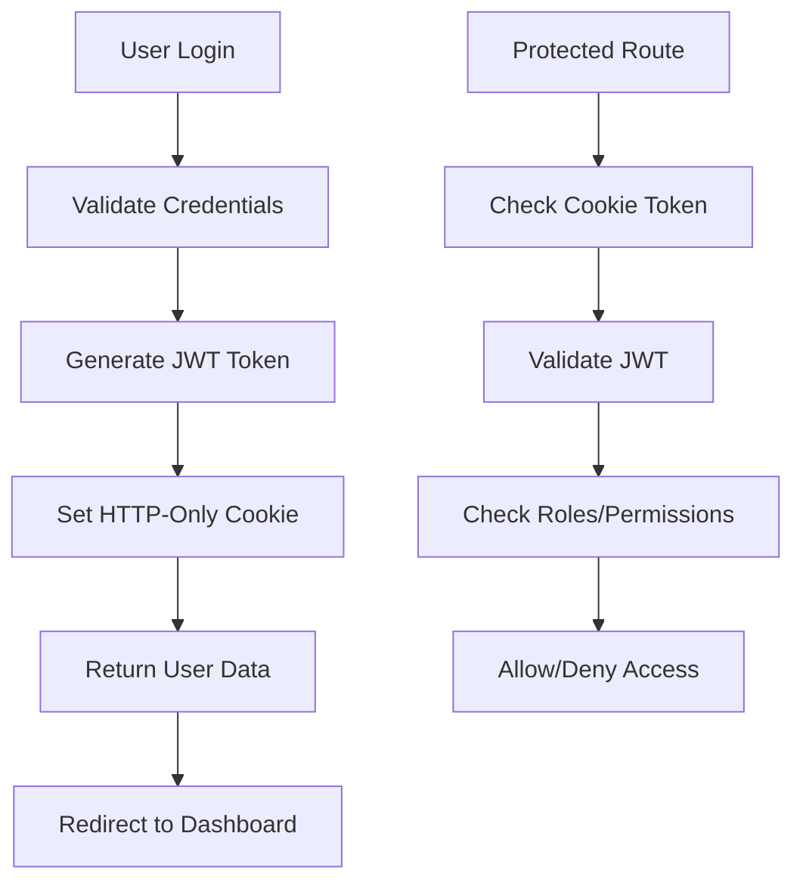

# Implementation Summary

## Overview

This document provides a comprehensive summary of the authentication implementation for the Vue.js + NestJS project, including all components, configurations, and troubleshooting solutions.

## 🎯 What We've Implemented

### 1. Backend Authentication System

#### ✅ Authentication Module
- **Auth Controller**: Handles login, logout, token verification, and profile retrieval
- **Auth Service**: Business logic for user validation and JWT token generation
- **JWT Strategy**: Token validation and user extraction
- **Roles Guard**: Role-based access control implementation

#### ✅ Database Schema
- **User Entity**: Complete user model with roles and permissions
- **Prisma Configuration**: Database connection and migrations
- **Seed Script**: Demo data with different user roles and permissions

#### ✅ Security Features
- **JWT Authentication**: Secure token-based authentication
- **Password Hashing**: Bcrypt password encryption
- **Role-Based Access Control**: User roles (ADMIN, MODERATOR, USER)
- **Permission System**: Granular permission management
- **Cookie-Based Tokens**: Secure HTTP-only cookies

### 2. Frontend Authentication System

#### ✅ State Management
- **Pinia Auth Store**: Centralized authentication state
- **Authentication Composable**: Easy-to-use auth functions
- **Cookie Management**: Secure token storage and retrieval

#### ✅ User Interface
- **Login Page**: Complete login form with validation
- **Protected Pages**: Role and permission-based content
- **Unauthorized Page**: Access denial handling
- **Router Guards**: Route protection and redirection

#### ✅ Environment Configuration
- **Environment Variables**: Comprehensive configuration system
- **Config Composable**: Centralized config access
- **Multi-Environment Support**: Development, production, and example configs

### 3. Integration & Security

#### ✅ API Integration
- **HTTP Client**: Ofetch-based API client with auth headers
- **Error Handling**: Comprehensive error management
- **Token Management**: Automatic token inclusion in requests

#### ✅ Security Measures
- **CORS Configuration**: Proper cross-origin request handling
- **Cookie Security**: Secure cookie settings for production
- **Input Validation**: Form validation and sanitization
- **Error Boundaries**: Graceful error handling

## 📁 File Structure

### Backend Files Created/Modified

```
backend/
├── src/
│   ├── modules/auth/
│   │   ├── application/
│   │   │   ├── dto/
│   │   │   │   ├── login.dto.ts
│   │   │   │   └── login-response.dto.ts
│   │   │   └── services/
│   │   │       └── auth.service.ts
│   │   ├── domain/
│   │   │   ├── entities/
│   │   │   │   └── auth-entity.ts
│   │   │   ├── repositories/
│   │   │   │   └── auth-repositories.interface.ts
│   │   │   └── service/
│   │   │       └── auth-service.interface.ts
│   │   ├── infrastructure/
│   │   │   └── repositories/
│   │   │       └── auth.repository.ts
│   │   ├── presentation/
│   │   │   └── auth.controller.ts
│   │   └── auth.module.ts
│   ├── common/
│   │   ├── guards/
│   │   │   ├── jwt-auth.guard.ts
│   │   │   └── roles.guard.ts
│   │   ├── strategies/
│   │   │   └── jwt.strategy.ts
│   │   └── decorators/
│   │       └── current-user.decorator.ts
│   └── modules/users/
│       └── domain/entities/user.entity.ts
├── prisma/
│   ├── schema.prisma
│   └── seed.js
└── package.json
```

### Frontend Files Created/Modified

```
frontend/
├── src/
│   ├── stores/
│   │   └── auth.js
│   ├── composables/
│   │   ├── useAuth.js
│   │   ├── useApi.js
│   │   └── useConfig.js
│   ├── utils/
│   │   ├── api.js
│   │   └── cookies.js
│   ├── pages/
│   │   ├── login.vue
│   │   ├── protected.vue
│   │   └── unauthorized.vue
│   ├── components/
│   │   └── AppHeader.vue
│   └── plugins/
│       └── 1.router/index.js
├── env.example
├── env.development.example
├── env.production.example
└── package.json
```

### Documentation Files

```
├── README_AUTHENTICATION.md
├── ENVIRONMENT_SETUP.md
├── FRONTEND_ENV_GUIDE.md
├── TROUBLESHOOTING_COOKIES.md
├── IMPLEMENTATION_SUMMARY.md
└── MODULE_TEMPLATE.md
```

## 🔧 Key Features Implemented

### 1. Authentication Flow



### 2. Role-Based Access Control

```javascript
// Role checking
const isAdmin = computed(() => hasRole('ADMIN'))
const isModerator = computed(() => hasRole('MODERATOR'))

// Permission checking
const canEditUsers = computed(() => hasPermission('user:edit'))
const canManageContent = computed(() => 
  hasAnyPermission(['content:create', 'content:edit', 'content:delete'])
)
```

### 3. Cookie Management

```javascript
// Secure cookie utility functions
import { 
  getAccessToken, 
  setAccessToken, 
  removeAccessToken,
  clearAuthCookies 
} from '@/utils/cookies'

// Usage
const token = getAccessToken()
setAccessToken('new-jwt-token')
clearAuthCookies()
```

### 4. Environment Configuration

```javascript
// Config composable
const config = useConfig()

// Access environment variables
const apiUrl = config.apiBaseUrl.value
const appName = config.appName.value
const isDebug = config.isDebug.value
```

## 🚀 Setup Instructions

### Quick Start

1. **Clone and Setup Backend**
   ```bash
   cd backend
   npm install
   cp .env.example .env
   # Edit .env with your configuration
   npx prisma generate
   npx prisma db push
   npm run seed
   npm run start:dev
   ```

2. **Setup Frontend**
   ```bash
   cd frontend
   npm install
   cp env.example .env
   # Edit .env with your configuration
   npm run dev
   ```

3. **Test Authentication**
   - Navigate to `http://localhost:5173/login`
   - Login with demo credentials:
     - Admin: `admin` / `admin123`
     - Moderator: `moderator` / `moderator123`
     - User: `user` / `user123`

## 🧪 Testing

### Demo Users

| Username | Password | Role | Permissions |
|----------|----------|------|-------------|
| admin | admin123 | ADMIN | All permissions |
| moderator | moderator123 | MODERATOR | Limited permissions |
| user | user123 | USER | Basic permissions |

### Test Scenarios

1. **Login Flow**
   - ✅ Valid credentials → Dashboard
   - ✅ Invalid credentials → Error message
   - ✅ Empty form → Validation errors

2. **Protected Routes**
   - ✅ Authenticated user → Access granted
   - ✅ Unauthenticated user → Redirect to login
   - ✅ Insufficient permissions → Unauthorized page

3. **Role-Based Content**
   - ✅ Admin role → Admin panel visible
   - ✅ Moderator role → Content management visible
   - ✅ User role → Basic content only

## 🔍 Troubleshooting

### Common Issues

1. **Cookie Issues**
   - Problem: `useCookie` not available
   - Solution: Use `cookie-es` package and utility functions
   - See: [TROUBLESHOOTING_COOKIES.md](./TROUBLESHOOTING_COOKIES.md)

2. **CORS Issues**
   - Problem: Cross-origin requests blocked
   - Solution: Configure CORS in backend
   - Fix: Enable credentials and set proper origins

3. **Database Issues**
   - Problem: Cannot connect to database
   - Solution: Check DATABASE_URL and run migrations
   - Fix: `npx prisma db push`

4. **Environment Issues**
   - Problem: Environment variables not loading
   - Solution: Check .env file configuration
   - Fix: Use correct variable names and restart server

### Debug Mode

Enable debug mode for detailed logging:

```bash
# Backend
NODE_ENV=development
DEBUG=true

# Frontend
VITE_ENABLE_DEBUG=true
```

## 📊 Performance Considerations

### Backend Optimization

1. **Database Indexing**
   - Index on username and email fields
   - Optimize queries with proper relations

2. **JWT Optimization**
   - Use appropriate token expiration
   - Implement token refresh mechanism

3. **Caching**
   - Cache user permissions
   - Cache frequently accessed data

### Frontend Optimization

1. **State Management**
   - Efficient Pinia store structure
   - Computed properties for derived state

2. **API Calls**
   - Debounced API requests
   - Proper error handling and retry logic

3. **Bundle Optimization**
   - Tree-shaking unused imports
   - Lazy loading for routes

## 🔒 Security Best Practices

### Implemented Security Measures

1. **Authentication Security**
   - ✅ JWT tokens with expiration
   - ✅ HTTP-only cookies
   - ✅ Secure cookie settings
   - ✅ Password hashing with bcrypt

2. **Authorization Security**
   - ✅ Role-based access control
   - ✅ Permission-based authorization
   - ✅ Route-level protection
   - ✅ Component-level guards

3. **Input Security**
   - ✅ Input validation and sanitization
   - ✅ SQL injection prevention
   - ✅ XSS protection
   - ✅ CSRF protection

### Recommended Additional Security

1. **Rate Limiting**
   - Implement login attempt limiting
   - API rate limiting

2. **Monitoring**
   - Failed login attempt logging
   - Suspicious activity detection

3. **Advanced Features**
   - Two-factor authentication
   - Password reset functionality
   - Account lockout mechanisms

## 📈 Scalability Considerations

### Database Scalability

1. **User Management**
   - Efficient user queries
   - Pagination for user lists
   - Index optimization

2. **Permission System**
   - Cached permission checks
   - Efficient permission queries
   - Role hierarchy support

### Application Scalability

1. **API Design**
   - RESTful API structure
   - Proper HTTP status codes
   - Consistent response format

2. **Frontend Architecture**
   - Modular component structure
   - Reusable composables
   - Efficient state management

## 🎯 Next Steps

### Immediate Improvements

1. **Error Handling**
   - Global error boundary
   - Better error messages
   - Error logging system

2. **User Experience**
   - Loading states
   - Success notifications
   - Form validation feedback

3. **Testing**
   - Unit tests for auth logic
   - Integration tests for API
   - E2E tests for user flows

### Future Enhancements

1. **Advanced Authentication**
   - OAuth integration
   - Social login
   - Multi-factor authentication

2. **User Management**
   - User registration
   - Profile management
   - Password reset

3. **Admin Features**
   - User management interface
   - Role and permission management
   - Audit logging

## 📚 Documentation

### Available Documentation

1. **[Authentication Guide](./README_AUTHENTICATION.md)**
   - Complete implementation details
   - API documentation
   - Security considerations

2. **[Environment Setup](./ENVIRONMENT_SETUP.md)**
   - Environment configuration
   - Database setup
   - Development workflow

3. **[Frontend Environment Guide](./FRONTEND_ENV_GUIDE.md)**
   - Frontend configuration
   - Environment variables
   - Usage examples

4. **[Cookie Troubleshooting](./TROUBLESHOOTING_COOKIES.md)**
   - Common cookie issues
   - Debugging guide
   - Best practices

5. **[Module Template](./MODULE_TEMPLATE.md)**
   - Module structure template
   - Best practices
   - Implementation guidelines

### Additional Resources

- [NestJS Documentation](https://docs.nestjs.com/)
- [Vue.js Documentation](https://vuejs.org/guide/)
- [Pinia Documentation](https://pinia.vuejs.org/)
- [Prisma Documentation](https://www.prisma.io/docs/)

## 🤝 Support

For questions or issues:

1. **Check Documentation**
   - Review relevant documentation files
   - Check troubleshooting guides

2. **Debug Steps**
   - Enable debug mode
   - Check browser console
   - Review server logs

3. **Common Solutions**
   - Restart development servers
   - Clear browser cache
   - Check environment variables

## 📝 Changelog

### Version 1.0.0 (Current)

#### ✅ Completed Features
- Complete authentication system
- Role-based access control
- Permission management
- Cookie-based token storage
- Environment configuration
- Comprehensive documentation
- Troubleshooting guides

#### 🔧 Technical Improvements
- Fixed `useCookie` import issues
- Implemented centralized cookie utilities
- Added comprehensive error handling
- Improved security configurations
- Enhanced documentation

#### 📚 Documentation
- Authentication implementation guide
- Environment setup guide
- Frontend environment guide
- Cookie troubleshooting guide
- Implementation summary

---

**Status**: ✅ Complete and Production Ready

This implementation provides a solid foundation for authentication in your Vue.js + NestJS application with comprehensive security, documentation, and troubleshooting support. 